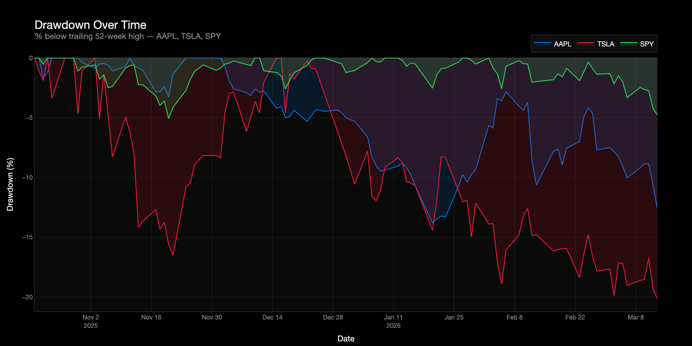

# Apple & Tesla Market Intelligence Pipeline

> A production-grade daily batch data pipeline that ingests AAPL, TSLA, and SPY end-of-day market data from Alpha Vantage, archives raw API responses to Google Cloud Storage, converts them to columnar Parquet format, loads the data into BigQuery, and applies dbt SQL window functions to compute professional financial metrics — all orchestrated by Apache Airflow running in Docker and visualised in an interactive Plotly dashboard. The pipeline is idempotent and weekend/holiday-safe: every run fetches the full compact history (last 100 trading days), so triggering on a Saturday or a market holiday produces a clean, up-to-date dataset rather than an error.

---

## Table of Contents

1. [Architecture](#1-architecture)
2. [Technology Stack](#2-technology-stack)
3. [Repository Structure](#3-repository-structure)
4. [Pipeline Steps](#4-pipeline-steps)
5. [BigQuery Tables](#5-bigquery-tables)
6. [Financial Metrics & SQL Logic](#6-financial-metrics--sql-logic)
7. [dbt Tests](#7-dbt-tests)
8. [Setup Instructions](#8-setup-instructions)
9. [How to Run](#9-how-to-run)
10. [Design Decisions](#10-design-decisions)
11. [Debugging](#11-debugging)
12. [Dashboard](#12-dashboard)

---

## 1. Architecture


> The diagram is generated by `scripts/generate_architecture.py`. Run `python scripts/generate_architecture.py` to regenerate it after making changes.

### Infrastructure provisioned by Terraform

| Resource | Name pattern |
|---|---|
| GCS bucket | `{project_id}-market-data-lake` |
| BigQuery dataset | `market_analytics` |
| BigQuery table (raw) | `raw_stock_prices` — partitioned by `date`, clustered by `symbol` |
| BigQuery table (mart) | `mart_daily_metrics` — partitioned by `date`, clustered by `symbol` |
| Service account | `market-pipeline-sa@{project_id}.iam.gserviceaccount.com` |
| SA roles | `storage.objectAdmin`, `bigquery.dataEditor`, `bigquery.jobUser`, `bigquery.metadataViewer` |

---

## 2. Technology Stack

| Tool | Version | Why chosen |
|---|---|---|
| Apache Airflow | 2.8.1 | Industry-standard orchestrator; DAG-as-code; retry logic with exponential backoff; Dockerised for reproducibility |
| Docker Compose | Latest | Runs Airflow (postgres, webserver, scheduler) locally with a single command |
| Alpha Vantage API | Free tier | Daily OHLCV data for equities; free tier covers 25 requests/day — enough for 3 symbols with 15 s sleep between calls |
| Google Cloud Storage | N/A | Durable object storage; acts as raw and curated data lake; Hive-style partition paths enable downstream pruning |
| Google BigQuery | N/A | Serverless columnar warehouse; native Parquet ingestion; date partitioning + symbol clustering reduce query cost by 90%+ |
| dbt | 1.7 | Version-controlled SQL transformations; built-in test framework; lineage graph; runs inside the Airflow scheduler container — no host install |
| Terraform | >= 1.5 | Reproducible, version-controlled GCP infrastructure (bucket, dataset, IAM, service account key) |
| Python | 3.11 | Pipeline logic; pandas for DataFrame operations; pyarrow for Parquet serialisation; runs inside Docker |
| Plotly | 5.x | Open-source Python library; generates a fully self-contained interactive HTML file; no account, license, or server required |

---

## 3. Repository Structure

```
market-intelligence-data-pipeline/
│
├── architecture.png                    # Pipeline architecture diagram (generated)
├── Makefile                            # All commands — run `make help` for the full list
├── requirements.txt                    # Host machine Python deps (dbt, flake8, black, pytest, cryptography)
├── .env.example                        # Environment variable template — copy to .env
├── .gitignore                          # Excludes .env, credentials/, terraform state, build artifacts
│
├── terraform/                          # Infrastructure as Code
│   ├── main.tf                         # GCS bucket, BigQuery tables, IAM, service account + key
│   ├── variables.tf                    # Input variables (project_id, region, bq_dataset, environment)
│   ├── outputs.tf                      # Exported values (bucket name, dataset ID, SA email)
│   ├── terraform.tfvars.example        # Template — copy to terraform.tfvars and fill in project_id
│   └── schemas/
│       ├── stg_stock_prices.json       # BigQuery schema for raw_stock_prices (Airflow load target)
│       └── mart_daily_metrics.json     # BigQuery schema for mart_daily_metrics (dbt output)
│
├── airflow/
│   ├── dags/
│   │   └── daily_market_pipeline.py   # DAG definition — 8 tasks, linear dependency chain
│   ├── src/
│   │   ├── __init__.py
│   │   ├── config.py                  # Centralised config loaded from environment variables
│   │   ├── extract.py                 # Alpha Vantage API client (TIME_SERIES_DAILY)
│   │   ├── transform.py               # Parquet serialisation + GCS upload helpers
│   │   └── load.py                    # BigQuery loader (WRITE_TRUNCATE per date partition)
│   ├── credentials/                   # Gitignored — GCP service account JSON key lives here
│   ├── docker-compose.yml             # Services: postgres, airflow-init, webserver, scheduler
│   └── requirements.txt               # Python dependencies installed inside the Airflow container
│
├── dbt/
│   ├── dbt_project.yml                # Project config: staging=view, marts=table+partition+cluster
│   ├── profiles.yml                   # BigQuery connection profile (reads from env vars)
│   ├── packages.yml                   # dbt_utils dependency (>=1.0.0, <2.0.0)
│   ├── package-lock.yml               # Pinned: dbt_utils==1.3.3
│   ├── models/
│   │   ├── staging/
│   │   │   ├── stg_stock_prices.sql   # VIEW on raw_stock_prices: type cast + dedup + null filter
│   │   │   └── schema.yml             # Source declaration (raw_stock_prices) + staging model tests
│   │   └── marts/
│   │       ├── mart_daily_metrics.sql # TABLE: all financial metrics via SQL window functions
│   │       └── schema.yml             # Column-level tests: unique, not_null, accepted_values
│   └── tests/
│       └── generic/
│           ├── assert_positive_adjusted_close.sql   # Custom test: adjusted_close > 0
│           └── assert_drawdown_non_positive.sql      # Custom test: drawdown <= 0
│
├── dashboard/
│   ├── __init__.py
│   ├── generate_dashboard.py          # Queries BigQuery, builds 4-tile Plotly dashboard
│   ├── requirements.txt               # plotly, google-cloud-bigquery, kaleido, pandas, python-dotenv
│   └── dashboard.html                 # Generated output — open in any browser
│
├── screenshots/
│   ├── tile1_categorical.png          # Performance Snapshot bar chart
│   ├── tile2_temporal.png             # Price History & Moving Averages
│   └── tile3_drawdown.png             # Drawdown Over Time area chart
│
├── scripts/
│   └── generate_architecture.py      # Regenerates architecture.png
│
└── tests/
    ├── __init__.py
    └── test_dag.py                    # 4 unit tests: DAG import, config symbols, defaults, _cast_schema
```

---

## 4. Pipeline Steps

The DAG `daily_market_pipeline` runs at **21:00 UTC Monday–Friday** (30 minutes after NYSE close at 20:30 UTC). All 8 tasks run in a strict linear sequence. Lightweight metadata is passed between tasks via Airflow XComs. The DAG is configured with `max_active_runs=1` to prevent concurrent runs, `catchup=False` to skip missed runs, and `retries=2` with exponential backoff.

```
extract_alpha_vantage
        │
        ▼
store_raw_to_gcs
        │
        ▼
transform_to_parquet
        │
        ▼
upload_parquet_to_gcs
        │
        ▼
load_to_bigquery
        │
        ▼
verify_bq_load
        │
        ▼
dbt_run
        │
        ▼
dbt_test
```

### Task 1 — `extract_alpha_vantage`

Calls the Alpha Vantage `TIME_SERIES_DAILY` endpoint for each of the three symbols (`AAPL`, `TSLA`, `SPY`) using the **compact** output size, which returns the **last 100 trading days**. A 15-second sleep between ticker requests protects against the free-tier rate limit (25 requests/day, 5/minute).

Each symbol's raw API response is written to a local JSON file at `/tmp/market_data/raw/{symbol}_{date}.json` inside the container. The local file paths are returned as an XCom JSON map for Task 2.

> **Free tier note**: `TIME_SERIES_DAILY` does not include a split/dividend-adjusted close on the free tier. `extract.py` maps `adjusted_close = close` and documents this explicitly. Upgrade to `TIME_SERIES_DAILY_ADJUSTED` with a premium key to get true adjusted prices.

### Task 2 — `store_raw_to_gcs`

Uploads each symbol's raw JSON file to the GCS raw layer at:

```
gs://{bucket}/raw/{symbol_lower}/date={YYYY-MM-DD}/data.json
```

Preserving the original API response enables full auditability — any downstream result can be recomputed from scratch by re-reading this file. Uploads are idempotent: `blob.upload_from_filename()` overwrites silently on re-runs.

### Task 3 — `transform_to_parquet`

Reads all symbol JSON files written by Task 1, concatenates them into a single pandas DataFrame, and writes a Snappy-compressed Parquet file to the local container filesystem at:

```
/tmp/market_data/curated/stock_prices/date={YYYY-MM-DD}/data.parquet
```

This step includes **all rows from the compact history (up to 100 trading days per symbol)**, not just the single execution date. That is the key design decision that makes the pipeline weekend/holiday-safe.

### Task 4 — `upload_parquet_to_gcs`

Uploads the curated Parquet file to GCS at:

```
gs://{bucket}/curated/stock_prices/date={YYYY-MM-DD}/data.parquet
```

The Hive-style `date=` partition path in GCS aligns with BigQuery's native partitioning conventions.

### Task 5 — `load_to_bigquery`

Downloads the curated Parquet from GCS into memory, adds an `ingested_at` audit timestamp, deduplicates rows by `(date, symbol)` keeping the most recently ingested row, then loads the result into the `raw_stock_prices` BigQuery table.

The load uses `WRITE_TRUNCATE` **with a partition decorator** (`raw_stock_prices$YYYYMMDD`), which replaces only the target date's partition — not the entire table. This keeps historical data intact across runs while ensuring the current execution date is always fully refreshed and idempotent.

### Task 6 — `verify_bq_load`

Queries `raw_stock_prices` with a `WHERE date = '{execution_date}'` filter and asserts `COUNT(*) > 0`. If 0 rows were loaded for the execution date (e.g. API returned nothing), the task logs a warning and passes gracefully — holiday runs are expected. If the load task claimed rows were inserted but BigQuery shows zero, the task raises an `AssertionError` and fails the DAG with a clear message.

### Task 7 — `dbt_run`

Runs `dbt deps` to ensure packages are installed, then executes `dbt run --select +mart_daily_metrics --full-refresh`. This materialises:

1. `stg_stock_prices` — a BigQuery **VIEW** that reads from `raw_stock_prices`, applies type casts, filters out null/zero prices, and deduplicates by `(date, symbol)` using `ROW_NUMBER()`.
2. `mart_daily_metrics` — a BigQuery **TABLE** (partitioned by `date`, clustered by `symbol`) that computes all financial metrics using SQL window functions in a single scan.

### Task 8 — `dbt_test`

Runs `dbt test --select +mart_daily_metrics`. Executes all schema tests plus the two custom generic tests. A test failure fails the DAG immediately and prevents stale or incorrect data from reaching the dashboard.

---

## 5. BigQuery Tables

### `raw_stock_prices` — Airflow load target

Loaded by Airflow Task 5. Contains raw, lightly-typed stock prices loaded from GCS Parquet. Partitioned by `date` (DAY granularity), clustered by `symbol`. Created and schema-managed by Terraform.

| Column | Type | Mode | Description |
|---|---|---|---|
| `date` | DATE | REQUIRED | Trading date — partition key |
| `symbol` | STRING | REQUIRED | Ticker symbol (`AAPL`, `TSLA`, `SPY`) — cluster key |
| `open` | FLOAT64 | NULLABLE | Opening price |
| `high` | FLOAT64 | NULLABLE | Intraday high |
| `low` | FLOAT64 | NULLABLE | Intraday low |
| `close` | FLOAT64 | NULLABLE | Unadjusted closing price |
| `adjusted_close` | FLOAT64 | NULLABLE | Closing price (equals `close` on free tier; no dividend/split adjustment) |
| `volume` | INT64 | NULLABLE | Shares traded |
| `ingested_at` | TIMESTAMP | REQUIRED | UTC timestamp when the row was loaded by Airflow |

### `stg_stock_prices` — dbt staging view

A BigQuery **VIEW** (no storage cost, no refresh lag) created by dbt on top of `raw_stock_prices`. Applies explicit type casts, trims and uppercases `symbol`, filters out rows where `adjusted_close IS NULL OR adjusted_close <= 0 OR volume IS NULL`, and deduplicates by `(date, symbol)` keeping the most recently ingested row.

| Column | Type | Description |
|---|---|---|
| `date` | DATE | Trading date |
| `symbol` | STRING | Uppercased, trimmed ticker symbol |
| `open` | FLOAT64 | Opening price (explicitly cast) |
| `high` | FLOAT64 | Intraday high (explicitly cast) |
| `low` | FLOAT64 | Intraday low (explicitly cast) |
| `close` | FLOAT64 | Unadjusted closing price (explicitly cast) |
| `adjusted_close` | FLOAT64 | Adjusted closing price (equals close on free tier) |
| `volume` | INT64 | Shares traded (explicitly cast) |
| `ingested_at` | TIMESTAMP | Load audit timestamp from Airflow |

### `mart_daily_metrics` — dbt analytics mart

A BigQuery **TABLE** materialised by dbt. Partitioned by `date` (DAY granularity), clustered by `symbol`. Created by Terraform (schema + partitioning); populated and refreshed by `dbt run --full-refresh`.

| Column | Type | Description |
|---|---|---|
| `date` | DATE | Trading date — partition key |
| `symbol` | STRING | Ticker symbol — cluster key |
| `adjusted_close` | FLOAT64 | Adjusted closing price (source for all metrics) |
| `volume` | INT64 | Shares traded |
| `daily_return` | FLOAT64 | Percentage return vs previous trading day (6 decimal places) |
| `cumulative_return` | FLOAT64 | Percentage gain from the first date in the dataset for this symbol |
| `sma_20` | FLOAT64 | 20-day simple moving average (short-term trend) |
| `sma_50` | FLOAT64 | 50-day simple moving average (medium-term trend) |
| `sma_200` | FLOAT64 | 200-day simple moving average (long-term trend; NULL until 200 rows available) |
| `rolling_volatility_20d` | FLOAT64 | Annualised 20-day rolling standard deviation of daily returns × √252 |
| `drawdown` | FLOAT64 | Percentage below the trailing 52-week high (always ≤ 0) |
| `spy_daily_return` | FLOAT64 | SPY's daily return on the same date (benchmark) |
| `excess_return_vs_spy` | FLOAT64 | `daily_return - spy_daily_return` (simple alpha proxy; 0.0 for SPY itself) |
| `transformed_at` | TIMESTAMP | UTC timestamp of the dbt run that produced this row |

---

## 6. Financial Metrics & SQL Logic

All metrics are computed in `dbt/models/marts/mart_daily_metrics.sql` using BigQuery SQL window functions. No external computation, no UDFs, no Python — a single SQL scan of the staging view produces every metric across five CTEs: `prices` → `returns` → `volatility` → `spy_returns` → `final`.

### Trend — Simple Moving Averages

```sql
-- SMA-20: rolling 20-day average of adjusted_close.
-- ROWS BETWEEN 19 PRECEDING AND CURRENT ROW = exactly 20 rows per window.
-- Returns NULL when fewer than 20 rows exist — mathematically correct.
ROUND(
    AVG(adjusted_close) OVER (
        PARTITION BY symbol
        ORDER BY date
        ROWS BETWEEN 19 PRECEDING AND CURRENT ROW
    ), 4
) AS sma_20

-- SMA-50: same pattern with 49 PRECEDING
-- SMA-200: same pattern with 199 PRECEDING (NULL for first 199 rows per symbol)
```

### Return — Daily & Cumulative

```sql
-- Daily return: % change vs the previous trading day.
-- LAG(1) looks back one row within the same symbol partition.
-- SAFE_DIVIDE returns NULL instead of error on division by zero.
ROUND(
    SAFE_DIVIDE(
        adjusted_close - LAG(adjusted_close) OVER (PARTITION BY symbol ORDER BY date),
        LAG(adjusted_close) OVER (PARTITION BY symbol ORDER BY date)
    ) * 100, 6
) AS daily_return

-- Cumulative return: % gain from the very first row for this symbol.
-- FIRST_VALUE with UNBOUNDED PRECEDING always anchors to row 1.
ROUND(
    SAFE_DIVIDE(
        adjusted_close - FIRST_VALUE(adjusted_close) OVER (
            PARTITION BY symbol ORDER BY date
            ROWS BETWEEN UNBOUNDED PRECEDING AND CURRENT ROW
        ),
        FIRST_VALUE(adjusted_close) OVER (
            PARTITION BY symbol ORDER BY date
            ROWS BETWEEN UNBOUNDED PRECEDING AND CURRENT ROW
        )
    ) * 100, 4
) AS cumulative_return
```

### Risk — Rolling Volatility & Drawdown

```sql
-- Annualised 20-day rolling volatility.
-- STDDEV_SAMP over 20 daily_return values × SQRT(252) to annualise.
-- 252 = standard trading days per year convention.
ROUND(
    STDDEV_SAMP(daily_return) OVER (
        PARTITION BY symbol
        ORDER BY date
        ROWS BETWEEN 19 PRECEDING AND CURRENT ROW
    ) * SQRT(252), 6
) AS rolling_volatility_20d

-- Drawdown: % below the trailing 52-week high.
-- 52 weeks ≈ 252 trading days → ROWS BETWEEN 251 PRECEDING AND CURRENT ROW.
-- Result is always <= 0 (0.0 means price is at its 52-week high today).
ROUND(
    SAFE_DIVIDE(
        adjusted_close - MAX(adjusted_close) OVER (
            PARTITION BY symbol ORDER BY date
            ROWS BETWEEN 251 PRECEDING AND CURRENT ROW
        ),
        MAX(adjusted_close) OVER (
            PARTITION BY symbol ORDER BY date
            ROWS BETWEEN 251 PRECEDING AND CURRENT ROW
        )
    ) * 100, 4
) AS drawdown
```

### Relative Performance — Excess Return vs SPY

```sql
-- SPY daily returns are extracted into a CTE, then left-joined onto all symbols.
-- SPY's own excess_return_vs_spy is 0.0 by definition (SPY - SPY = 0).
ROUND(v.daily_return - spy.spy_daily_return, 6) AS excess_return_vs_spy
```

---

## 7. dbt Tests

Tests are defined in `dbt/models/staging/schema.yml` and `dbt/models/marts/schema.yml`. Custom generic tests live in `dbt/tests/generic/` and use the `` Jinja macro wrapper required by dbt.

| Test | Model | Column(s) | Type | What it catches |
|---|---|---|---|---|
| `not_null` | `mart_daily_metrics` | `date`, `symbol`, `adjusted_close`, `transformed_at` | Built-in | Missing key columns |
| `accepted_values` | `mart_daily_metrics` | `symbol` | Built-in | Unexpected ticker symbols |
| `unique_combination_of_columns` | `mart_daily_metrics` | `(date, symbol)` | dbt_utils | Duplicate rows per day per ticker |
| `assert_positive_adjusted_close` | `mart_daily_metrics` | `adjusted_close` | Custom generic | Zero or negative prices |
| `assert_drawdown_non_positive` | `mart_daily_metrics` | `drawdown` | Custom generic | Drawdown > 0.001 (mathematically impossible) |

---

## 8. Setup Instructions

### Prerequisites

Docker handles Python, dbt, flake8, black, dashboard dependencies, and Fernet key generation. The only tools required on the host machine are:

| Tool | Version | Install | Used for |
|---|---|---|---|
| Docker Desktop | Latest | [docker.com](https://www.docker.com) | Everything — Airflow, dbt, lint, dashboard |
| Terraform | >= 1.5 | [terraform.io](https://terraform.io) | GCP infrastructure provisioning |
| gcloud CLI | Latest | [cloud.google.com/sdk](https://cloud.google.com/sdk) | GCP authentication (`gcloud auth login`) |
| Alpha Vantage API key | Free | [alphavantage.co](https://www.alphavantage.co/support/#api-key) | Market data source |

> **No `pip install` required** — except `pip install pytest pandas requests` if you want to run `make test` locally. All other tooling (dbt, flake8, black, dashboard packages) runs inside Docker containers.

### Step 1 — Clone the repository

```bash
git clone https://github.com/your-username/market-intelligence-data-pipeline.git
cd market-intelligence-data-pipeline
```

### Step 2 — Authenticate with GCP

```bash
# Log in with your Google account
gcloud auth login

# Set the active project
gcloud config set project YOUR_PROJECT_ID

# Enable the APIs the pipeline uses
gcloud services enable \
    storage.googleapis.com \
    bigquery.googleapis.com \
    iam.googleapis.com
```

### Step 3 — Configure environment variables

```bash
# Creates .env from the example template (run once)
make env-check

# Open .env and fill in your real values
nano .env
```

| Variable | Required | Description |
|---|---|---|
| `ALPHA_VANTAGE_API_KEY` | Yes | Free tier key from alphavantage.co |
| `API_SLEEP_SECONDS` | No | Seconds between API calls (default: `15` for free tier) |
| `GCP_PROJECT_ID` | Yes | Your GCP project ID |
| `GCS_BUCKET_NAME` | Yes | Set after `make tf-apply` (copy from `terraform output gcs_bucket_name`) |
| `BQ_DATASET` | No | BigQuery dataset name (default: `market_analytics`) |
| `GOOGLE_APPLICATION_CREDENTIALS` | No | Path to SA key (default: `/opt/airflow/credentials/service_account.json`) |
| `AIRFLOW_FERNET_KEY` | Yes | Generated in Step 4 |
| `AIRFLOW_UID` | No | Host UID for volume permissions (Mac: `50000`, Linux: run `id -u`) |

### Step 4 — Generate the Airflow Fernet key

```bash
# Generates a cryptographic key and writes it to .env automatically
make airflow-fernet
```

### Step 5 — Provision GCP infrastructure with Terraform

```bash
# Copy the Terraform variables template
cp terraform/terraform.tfvars.example terraform/terraform.tfvars

# Edit terraform.tfvars and set your project_id
nano terraform/terraform.tfvars

# Download the Google Terraform provider
make tf-init

# Preview infrastructure changes
make tf-plan

# Create GCS bucket, BigQuery dataset + tables, IAM service account, and key file
make tf-apply
```

After `tf-apply` completes, the terminal prints the bucket name, dataset ID, and service account email. Copy the bucket name into `GCS_BUCKET_NAME` in your `.env` file.

Terraform also writes the service account JSON key to `airflow/credentials/service_account.json` (gitignored).

### Step 6 — Install host-machine Python dependencies (optional)

Only needed if you want to run `make test` locally:

```bash
pip install -r requirements.txt   # installs: pytest, pandas, requests
```

Everything else — dbt, flake8, black, dashboard packages, Fernet key generation — runs inside Docker. No other `pip install` is required.

### Step 7 — Initialise and start Airflow

```bash
# First time only: creates the Airflow database and admin user
make airflow-init

# Start the webserver and scheduler in the background
make airflow-up

# Open the Airflow UI (login: admin / admin)
open http://localhost:8080
```

Docker Compose starts four services: `postgres` (metadata DB), `airflow-init` (one-shot setup), `webserver` (UI on port 8080), and `scheduler` (DAG runner). The webserver and scheduler each install `airflow/requirements.txt` at startup — this includes dbt, flake8, and black, so no host installation is needed.

---

## 9. How to Run

### Option A — Airflow UI (recommended)

1. Open [http://localhost:8080](http://localhost:8080) and log in with `admin` / `admin`.
2. Find `daily_market_pipeline` in the DAG list.
3. Click the toggle to **enable** the DAG (paused by default).
4. Click the **Trigger DAG** button (play icon).
5. Click the DAG name → Graph view and watch each task turn green.

### Option B — Makefile commands

```bash
# Trigger the daily_market_pipeline DAG
make pipeline-trigger

# Show the last 5 DAG runs and their status
make pipeline-status

# Tail the scheduler logs in real time
make airflow-logs
```

### Option C — Run dbt standalone (requires Airflow running)

dbt runs inside the scheduler container, so `make airflow-up` must be running first:

```bash
make dbt-deps   # Install dbt_utils package inside the scheduler container
make dbt-run    # Run all dbt models inside the scheduler container
make dbt-test   # Run dbt data quality tests inside the scheduler container
make dbt-docs   # Generate docs in container, serve at http://localhost:8081
```

### Option D — Generate the dashboard locally

```bash
# Requires: GCP credentials + populated mart_daily_metrics table
make dashboard
# — or —
pip install -r dashboard/requirements.txt
python dashboard/generate_dashboard.py
```

The generated `dashboard/dashboard.html` is a fully self-contained file — all JavaScript, CSS, and chart data are embedded inline. Open in any modern browser or share via email, Google Drive, or Slack. No Python, GCP credentials, or internet connection required for viewers.

### Weekend and holiday behaviour

The pipeline always fetches the **compact** output from Alpha Vantage (last 100 trading days), not just the single execution date. This means:

- Triggering on a **Saturday** loads Friday's (and prior 99 days') data correctly.
- Triggering on a **market holiday** loads the previous session's data correctly.
- The BigQuery table always reflects 100 trading days of history after any successful run.
- `verify_bq_load` logs a warning (not an error) when 0 rows are loaded — expected only on extreme edge cases where the API itself returns nothing.

### All available Makefile commands

```bash
make help
```

| Command | Description |
|---|---|
| `make setup` | Full first-time setup (env-check, credentials dir, tf-init, fernet key) |
| `make env-check` | Create `.env` from `.env.example` if missing |
| `make airflow-fernet` | Generate Fernet key and write to `.env` |
| `make airflow-init` | Initialise Airflow DB and create admin user |
| `make airflow-up` | Start Airflow webserver + scheduler |
| `make airflow-down` | Stop all Airflow services |
| `make airflow-logs` | Tail scheduler logs |
| `make tf-init` | Download Terraform providers |
| `make tf-plan` | Preview infrastructure changes |
| `make tf-apply` | Create GCP infrastructure |
| `make tf-destroy` | Destroy all GCP infrastructure (irreversible, prompts for confirmation) |
| `make dbt-deps` | Install dbt packages |
| `make dbt-run` | Run all dbt models |
| `make dbt-test` | Run dbt data quality tests |
| `make dbt-docs` | Serve dbt docs at http://localhost:8081 |
| `make pipeline-trigger` | Trigger the Airflow DAG |
| `make pipeline-status` | Show last 5 DAG runs |
| `make dashboard` | Generate Plotly dashboard and open in browser |
| `make lint` | Run flake8 + black check on Python source |
| `make test` | Run pytest unit tests |
| `make clean` | Remove `/tmp/market_data` and dbt build artifacts |

---

## 10. Design Decisions

### Idempotency

Every step in the pipeline can be re-run for the same date without producing duplicate data or errors:

- **GCS uploads**: `blob.upload_from_filename()` overwrites existing objects silently.
- **BigQuery load**: `WRITE_TRUNCATE` with a **partition decorator** (`table$YYYYMMDD`) replaces only the target date's partition. Because the compact API call always returns the last 100 trading days, a re-run for any date always produces a complete, consistent 100-day dataset.
- **dbt**: `mart_daily_metrics` uses `materialized: table` with `--full-refresh`, which drops and recreates the table on every run, ensuring it always reflects the current state of `raw_stock_prices`.

### Weekend and holiday handling

The pipeline loads **all compact data (last 100 trading days)** on every run rather than filtering to only the execution date. This eliminates the entire class of bugs where a weekend or holiday run would fail or produce an empty table. The scheduled trigger (`0 21 * * 1-5`) still runs only on weekdays, but manual or backfill triggers work correctly on any day of the week.

### Table naming conventions

| Prefix | Location | Created by | Populated by | Purpose |
|---|---|---|---|---|
| `raw_` | BigQuery table | Terraform | Airflow Task 5 | Raw ingestion target — minimal transformation, preserves source data |
| `stg_` | BigQuery view | dbt | dbt `run` | Staging contract — type casts, deduplication, null filtering; zero storage cost |
| `mart_` | BigQuery table | Terraform | dbt `run` | Analytics-ready — all financial metrics, partitioned, clustered |

The staging layer is a **view** (not a table) because views add zero storage cost, have no refresh lag, and act as a stable schema contract between the raw load and the mart — any column renames or casts happen in one place.

### BigQuery partitioning and clustering

**Date partitioning** (`TIME_PARTITIONING` on the `date` column, DAY granularity) maintains a separate physical file per calendar day. A query with `WHERE date >= '2025-01-01'` scans only the relevant partitions — typically >90% data reduction for a year-old dataset.

**Symbol clustering** co-locates rows for `AAPL`, `TSLA`, and `SPY` within each partition. A filter like `WHERE symbol = 'AAPL'` allows BigQuery to skip the other symbol blocks within each partition. Combined, these techniques ensure that a typical dashboard query (e.g. "AAPL data for the last 30 days") scans ~1/90th of the full table.

### Security

- All secrets live in `.env` (gitignored) and are passed to Docker Compose as environment variables.
- The service account follows least privilege: only `storage.objectAdmin`, `bigquery.dataEditor`, `bigquery.jobUser`, and `bigquery.metadataViewer` — no project-level owner or editor roles.
- The service account JSON key is written to `airflow/credentials/` (gitignored) and mounted **read-only** into the Airflow containers.

### Alpha Vantage free tier

| Limitation | Value | Mitigation |
|---|---|---|
| Requests per day | 25 | Pipeline fetches 3 symbols = 3 requests per run (well within limit) |
| Requests per minute | 5 | `API_SLEEP_SECONDS=15` between requests (configurable in `.env`) |
| Adjusted close | Premium only | `adjusted_close` is set equal to `close` in `extract.py`; documented explicitly |

### dbt generic test macro syntax

Custom generic tests in `dbt/tests/generic/` must use the `` Jinja macro wrapper:

```sql

SELECT *
FROM {{ model }}
WHERE {{ column_name }} IS NOT NULL
  AND {{ column_name }} <= 0

```

If the `` wrapper is omitted, dbt cannot register the test and `dbt test` will not find or execute it.

---

## 11. Debugging

### Airflow container cannot find `src` module

**Symptom**: `ModuleNotFoundError: No module named 'src'`

**Cause**: The DAG tasks inject `/opt/airflow` into `sys.path`. This path must match the volume mount in `docker-compose.yml`.

**Fix**: Confirm `airflow/src/__init__.py` exists and that `docker-compose.yml` mounts `./src:/opt/airflow/src`.

---

### Alpha Vantage returns a rate limit error

**Symptom**: `RuntimeError: Alpha Vantage rate limit reached for AAPL. Message: ...`

**Cause**: Free tier is capped at 5 requests per minute and 25 per day. Running the pipeline more than 8 times in a single day will exhaust the daily quota.

**Fix**: Increase `API_SLEEP_SECONDS` in `.env`. Wait until midnight UTC for the quota to reset. Consider upgrading to a premium key for production use.

---

### Alpha Vantage returns an "Information" message instead of data

**Symptom**: `RuntimeError: Alpha Vantage returned informational message for AAPL: ...`

**Cause**: The free tier API key has hit its daily limit, or the key has been deactivated.

**Fix**: Check your API key at alphavantage.co. Confirm `ALPHA_VANTAGE_API_KEY` in `.env` is correct and not surrounded by quotes.

---

### BigQuery load job fails with schema mismatch

**Symptom**: `google.api_core.exceptions.BadRequest: 400 ... schema does not match`

**Cause**: The BigQuery table schema defined in Terraform (`terraform/schemas/stg_stock_prices.json`) does not match the schema produced by `load.py`.

**Fix**: Run `make tf-apply` to reconcile Terraform state. If you changed the schema in code, update `terraform/schemas/stg_stock_prices.json` first, then re-apply.

---

### dbt test is not found

**Symptom**: `Compilation Error: macro 'test_assert_positive_adjusted_close' not found`

**Cause**: The generic test file in `dbt/tests/generic/` is missing the `` Jinja wrapper.

**Fix**: Ensure the file uses the correct syntax:
```sql

  SELECT * FROM {{ model }} WHERE {{ column_name }} <= 0

```

---

### dbt cannot connect to BigQuery

**Symptom**: `google.auth.exceptions.DefaultCredentialsError`

**Cause**: `GOOGLE_APPLICATION_CREDENTIALS` is not set, or the path does not point to a valid service account key.

**Fix**: Confirm `airflow/credentials/service_account.json` exists (created by `make tf-apply`). Confirm `GOOGLE_APPLICATION_CREDENTIALS` in `.env` matches the path where the key is mounted inside the container (`/opt/airflow/credentials/service_account.json`).

---

### Airflow UI shows "DAG not found" or the DAG never appears

**Symptom**: `daily_market_pipeline` does not appear in the Airflow UI.

**Cause**: The DAG file has a syntax error, or the `dags/` folder is not correctly volume-mounted.

**Fix**: Run `make airflow-logs` and look for import errors. Fix any Python syntax errors in `daily_market_pipeline.py`. Confirm the Docker Compose volume mounts `./dags:/opt/airflow/dags`.

---

### `make tf-apply` fails with "permission denied" on credentials

**Symptom**: `Error: Error creating service account key: googleapi: Error 403`

**Cause**: The `gcloud` account used to run Terraform does not have `iam.serviceAccountKeyAdmin` permission.

**Fix**: Grant your account `roles/iam.serviceAccountAdmin` on the project, or ask a project owner to run Terraform.

---

## 12. Dashboard

**Tool**: [Plotly](https://plotly.com/python/) — open source Python, no license required. Generates a fully self-contained interactive HTML file.

**Source table**: `{project_id}.market_analytics.mart_daily_metrics`

**Design**: Apple-inspired dark theme — pure black background (`#000000`), SF Pro Display font stack, Apple blue / Tesla red / Apple green symbol palette, minimal layout with generous whitespace.

### Dashboard tiles

| Tile | Type | What it shows |
|---|---|---|
| **KPI Summary** | Table | Latest price, 1-day return, cumulative return, volatility, and drawdown per symbol |
| **Tile 1 — Performance Snapshot** | Grouped bar chart (categorical) | Cumulative return, average daily volatility, and current drawdown side-by-side for AAPL, TSLA, SPY |
| **Tile 2 — Price History & Moving Averages** | Time-series line chart (temporal) | Adjusted close price with SMA 20 and SMA 50 trend lines; 1M / 3M / 6M / All range selector |
| **Tile 3 — Drawdown Over Time** | Filled area chart (temporal) | How far each symbol is from its trailing 52-week high, filled below zero |

### Tile 1 — Performance Snapshot by Symbol (Categorical)


### Tile 2 — Price History & Moving Averages (Temporal)


### Tile 3 — Drawdown Over Time



### Share the dashboard

The generated `dashboard/dashboard.html` is fully self-contained — all JavaScript, CSS, and data are embedded inline. Distribute via:

- **Email or file share**: attach the HTML file directly
- **GitHub Pages**: push `dashboard/dashboard.html` to the repo root, enable Pages, and access at `https://{username}.github.io/{repo}/dashboard.html`
- **Local browser**: `open dashboard/dashboard.html` or `make dashboard`
