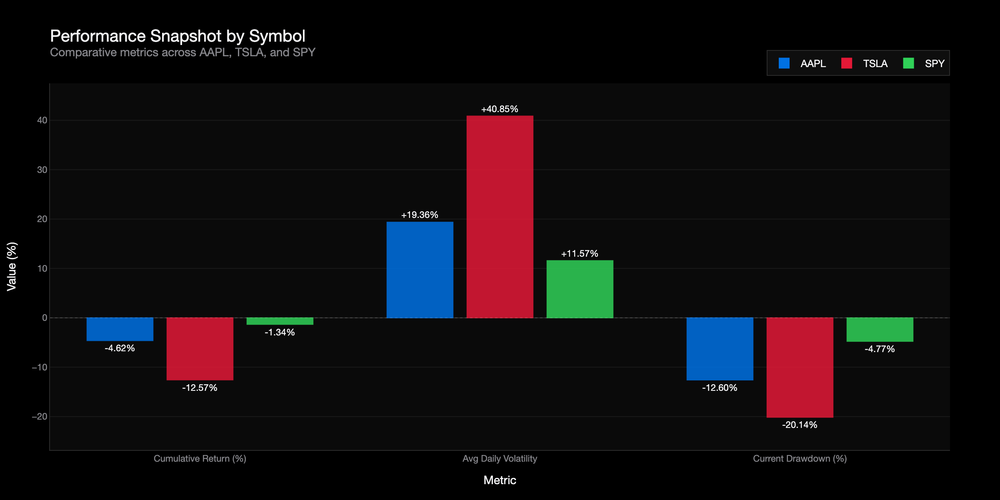
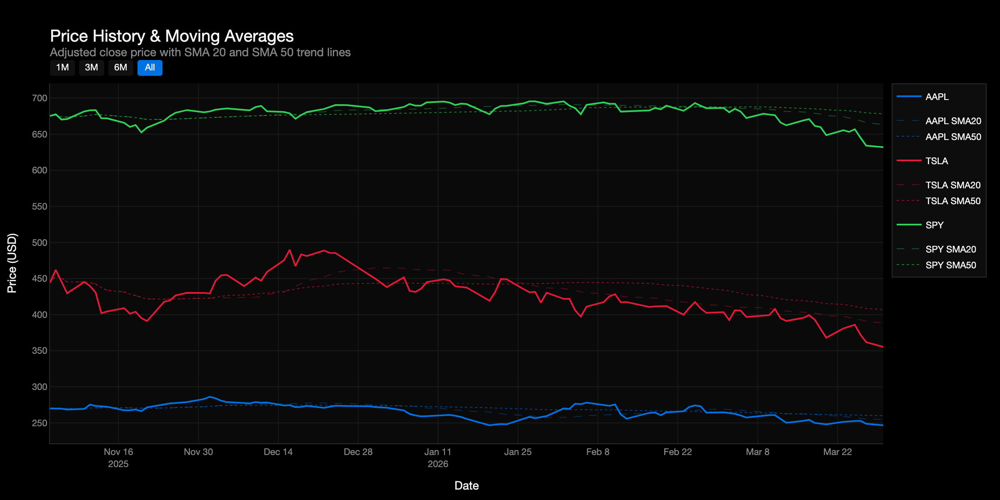

# Apple & Tesla Market Intelligence Pipeline

> A production-grade daily batch data pipeline that ingests AAPL, TSLA, and SPY end-of-day market data from Alpha Vantage, archives raw API responses to Google Cloud Storage, converts them to columnar Parquet format, loads the data into BigQuery, and applies dbt SQL window functions to compute professional financial metrics — all orchestrated by Apache Airflow running in Docker and visualised in an interactive Plotly dashboard. The pipeline is idempotent and weekend/holiday-safe: every run loads the full compact history (last 100 trading days), so triggering on a Saturday or a market holiday produces a clean, up-to-date dataset rather than an error.

---

## Table of Contents

1. [Architecture](#1-architecture)
2. [Technology Stack](#2-technology-stack)
3. [Repository Structure](#3-repository-structure)
4. [Pipeline Steps](#4-pipeline-steps)
5. [BigQuery Tables](#5-bigquery-tables)
6. [Financial Metrics & SQL Logic](#6-financial-metrics--sql-logic)
7. [dbt Tests](#7-dbt-tests)
8. [Setup Instructions](#8-setup-instructions)
9. [How to Run](#9-how-to-run)
10. [Design Decisions](#10-design-decisions)
11. [Debugging](#11-debugging)
12. [Dashboard](#12-dashboard)

---

## 1. Architecture

```
┌──────────────────────────────────────────────────────────────────────┐
│  Alpha Vantage REST API                                              │
│  TIME_SERIES_DAILY — AAPL, TSLA, SPY (last 100 trading days)        │
└────────────────────────────┬─────────────────────────────────────────┘
                             │  JSON (per symbol)
                             ▼
┌──────────────────────────────────────────────────────────────────────┐
│  Apache Airflow 2.8  (Docker Compose)                                │
│                                                                      │
│  [1] extract_alpha_vantage   → /tmp/market_data/raw/*.json           │
│  [2] store_raw_to_gcs        → GCS raw/ layer                        │
│  [3] transform_to_parquet    → /tmp/market_data/curated/*.parquet    │
│  [4] upload_parquet_to_gcs   → GCS curated/ layer                   │
│  [5] load_to_bigquery        → raw_stock_prices (WRITE_TRUNCATE)     │
│  [6] verify_bq_load          → assert row_count > 0                  │
│  [7] dbt_run                 → mart_daily_metrics                    │
│  [8] dbt_test                → data quality checks                   │
└────────────────────────────┬─────────────────────────────────────────┘
                             │
          ┌──────────────────▼──────────────────────────────┐
          │          Google Cloud Storage                    │
          │                                                  │
          │  raw/                                            │
          │  ├── aapl/date=YYYY-MM-DD/data.json              │
          │  ├── tsla/date=YYYY-MM-DD/data.json              │
          │  └── spy/date=YYYY-MM-DD/data.json               │
          │                                                  │
          │  curated/                                        │
          │  └── stock_prices/date=YYYY-MM-DD/data.parquet   │
          └──────────────────┬──────────────────────────────┘
                             │  BigQuery Load Job
          ┌──────────────────▼──────────────────────────────┐
          │          BigQuery  (dataset: market_analytics)   │
          │                                                  │
          │  raw_stock_prices   ←── Airflow loads here       │
          │  (partitioned by date, clustered by symbol)      │
          │         │                                        │
          │         │  dbt VIEW                              │
          │         ▼                                        │
          │  stg_stock_prices                                │
          │  (view: dedup + type cast + filter nulls)        │
          │         │                                        │
          │         │  dbt TABLE                             │
          │         ▼                                        │
          │  mart_daily_metrics                              │
          │  (partitioned by date, clustered by symbol)      │
          └──────────────────┬──────────────────────────────┘
                             │
          ┌──────────────────▼──────────────────────────────┐
          │          Plotly Dashboard (dashboard.html)       │
          │  KPI Table: Latest price, return, volatility     │
          │  Tile 1: Performance Snapshot (categorical bar)  │
          │  Tile 2: Price History & Moving Averages (line)  │
          │  Tile 3: Drawdown Over Time (area chart)         │
          └──────────────────────────────────────────────────┘
```

### Infrastructure provisioned by Terraform

| Resource | Name pattern |
|---|---|
| GCS bucket | `{project_id}-market-data-lake` |
| BigQuery dataset | `market_analytics` |
| Service account | `market-pipeline-sa@{project_id}.iam.gserviceaccount.com` |
| SA roles | `storage.objectAdmin`, `bigquery.dataEditor`, `bigquery.jobUser`, `bigquery.metadataViewer` |

---

## 2. Technology Stack

| Tool | Version | Why chosen |
|---|---|---|
| Apache Airflow | 2.8 | Industry-standard orchestrator; DAG-as-code; retry logic; Dockerised for reproducibility |
| Docker Compose | Latest | Runs Airflow (postgres, webserver, scheduler) locally with a single command |
| Alpha Vantage API | Free tier | Daily OHLCV data for equities; free tier covers 25 requests/day (enough for 3 symbols) |
| Google Cloud Storage | N/A | Durable, cheap object storage; acts as the raw and curated data lake |
| Google BigQuery | N/A | Serverless columnar warehouse; native Parquet ingestion; date partitioning + symbol clustering |
| dbt | 1.7 | Version-controlled SQL transformations; built-in test framework; lineage graph |
| Terraform | >= 1.5 | Reproducible, version-controlled GCP infrastructure (bucket, dataset, IAM) |
| Python | 3.11 | Pipeline logic; pandas for DataFrame operations; pyarrow for Parquet |
| Plotly | 5.x | Open-source Python library; generates a fully self-contained interactive HTML file; no account or license required; shareable via email or any file host |

---

## 3. Repository Structure

```
apple-tesla-market-intelligence-pipeline/
│
├── terraform/                          # Infrastructure as Code
│   ├── main.tf                         # GCS bucket, BigQuery dataset, IAM, service account
│   ├── variables.tf                    # Input variables (project_id, region, etc.)
│   ├── outputs.tf                      # Exported values (bucket name, dataset ID, SA email)
│   ├── terraform.tfvars.example        # Template — copy to terraform.tfvars
│   └── schemas/
│       ├── stg_stock_prices.json       # BigQuery schema (Airflow raw load target)
│       └── mart_daily_metrics.json     # BigQuery schema (dbt mart output)
│
├── airflow/
│   ├── dags/
│   │   └── daily_market_pipeline.py   # DAG definition (8 tasks)
│   ├── src/
│   │   ├── __init__.py
│   │   ├── config.py                  # Centralised config from environment variables
│   │   ├── extract.py                 # Alpha Vantage API client (TIME_SERIES_DAILY)
│   │   ├── transform.py               # Parquet conversion + GCS upload helpers
│   │   └── load.py                    # BigQuery loader (WRITE_TRUNCATE)
│   ├── credentials/                   # Gitignored — GCP service account JSON key lives here
│   ├── docker-compose.yml             # Services: postgres, airflow-init, webserver, scheduler
│   └── requirements.txt               # Python dependencies installed inside the container
│
├── dbt/
│   ├── dbt_project.yml                # Project config: staging=view, marts=table+partition+cluster
│   ├── profiles.yml                   # BigQuery connection profile
│   ├── packages.yml                   # dbt_utils dependency
│   ├── models/
│   │   ├── staging/
│   │   │   ├── stg_stock_prices.sql   # VIEW on raw_stock_prices: dedup + type cast
│   │   │   └── schema.yml             # Source declaration + staging model tests
│   │   └── marts/
│   │       ├── mart_daily_metrics.sql # TABLE: all financial metrics (window functions)
│   │       └── schema.yml             # Column-level tests: unique, not_null, accepted_values
│   └── tests/
│       └── generic/
│           ├── assert_positive_adjusted_close.sql   # Custom test: adjusted_close > 0
│           └── assert_drawdown_non_positive.sql      # Custom test: drawdown <= 0
│
├── Makefile                           # All commands — run `make help` to see the full list
├── requirements.txt                   # Host machine Python deps (dbt, flake8, black, pytest)
├── .env.example                       # Environment variable template
├── .gitignore                         # Excludes .env, credentials/, terraform state, artifacts
└── README.md                          # This file
```

---

## 4. Pipeline Steps

The DAG `daily_market_pipeline` runs at **21:00 UTC Monday–Friday** (30 minutes after NYSE close). All 8 tasks run in a linear sequence; each passes lightweight metadata to the next via Airflow XComs.

```
extract_alpha_vantage
        │
        ▼
store_raw_to_gcs
        │
        ▼
transform_to_parquet
        │
        ▼
upload_parquet_to_gcs
        │
        ▼
load_to_bigquery
        │
        ▼
verify_bq_load
        │
        ▼
dbt_run
        │
        ▼
dbt_test
```

### Task 1 — `extract_alpha_vantage`

Calls the Alpha Vantage `TIME_SERIES_DAILY` endpoint for each of the three symbols (`AAPL`, `TSLA`, `SPY`) using the **compact** output size, which returns the **last 100 trading days**. A 15-second sleep between ticker requests protects against the free-tier rate limit (25 requests/day, 5/minute). Each symbol's data is written to a local JSON file at `/tmp/market_data/raw/{symbol}_{date}.json`. The local paths are returned as an XCom JSON map for the next task.

> **Note on the free tier**: Alpha Vantage's free tier provides `TIME_SERIES_DAILY` (unadjusted). The `TIME_SERIES_DAILY_ADJUSTED` endpoint (split/dividend-adjusted) is a premium feature. To keep this project fully reproducible without a paid key, `adjusted_close` is set equal to `close` in the extract schema — this is documented explicitly in `extract.py` and `config.py`.

### Task 2 — `store_raw_to_gcs`

Uploads each symbol's raw JSON file to the GCS raw layer at:

```
gs://{bucket}/raw/{symbol_lower}/date={YYYY-MM-DD}/data.json
```

Preserving the original API response enables full auditability — any downstream result can be recomputed from scratch by re-reading this file. Uploads use `blob.upload_from_filename()`, which overwrites silently on re-runs (idempotent).

### Task 3 — `transform_to_parquet`

Reads all symbol JSON files written in Task 1, concatenates them into a single pandas DataFrame, and writes a Snappy-compressed Parquet file to the local container filesystem at:

```
/tmp/market_data/curated/stock_prices/date={YYYY-MM-DD}/data.parquet
```

The transform step does **not** filter to a single date — it includes all rows from the compact history (up to 100 trading days per symbol). This is the key design decision that makes the pipeline weekend/holiday-safe.

### Task 4 — `upload_parquet_to_gcs`

Uploads the curated Parquet file to GCS at:

```
gs://{bucket}/curated/stock_prices/date={YYYY-MM-DD}/data.parquet
```

The Hive-style `date=` partition path in GCS aligns with BigQuery's external table and native partitioning conventions.

### Task 5 — `load_to_bigquery`

Downloads the curated Parquet from GCS into memory, adds an `ingested_at` audit timestamp, deduplicates rows by `(date, symbol)` keeping the most recently ingested row, and loads the result into the `raw_stock_prices` BigQuery table using `WRITE_TRUNCATE` on the full table. The table is defined with `TIME_PARTITIONING` on the `date` field and clustered by `symbol`.

> **Important**: The target table at this stage is **`raw_stock_prices`** — this is the raw ingestion table. The `stg_stock_prices` name refers to the dbt staging *view* built on top of it, not the Airflow load target.

### Task 6 — `verify_bq_load`

Queries `raw_stock_prices` and asserts that `COUNT(*) > 0`. If the pipeline ran on a market holiday and 0 rows were loaded, this task logs a warning and passes gracefully (it does not fail the DAG, because holiday runs are expected). If rows were loaded but the count is unexpectedly zero, the task raises an `AssertionError` and fails the DAG with a clear message.

### Task 7 — `dbt_run`

Runs `dbt deps` to ensure packages are installed, then executes `dbt run --select +mart_daily_metrics`. This materialises:

1. `stg_stock_prices` — a BigQuery VIEW that reads from `raw_stock_prices`, applies type casts, filters out null/zero prices, and deduplicates by `(date, symbol)`.
2. `mart_daily_metrics` — a BigQuery TABLE (partitioned by `date`, clustered by `symbol`) that computes all financial metrics using SQL window functions.

The `--full-refresh` flag is included so the mart table is always rebuilt from the current state of `raw_stock_prices`.

### Task 8 — `dbt_test`

Runs `dbt test --select +mart_daily_metrics`. Executes all schema tests defined in `schema.yml` files plus the two custom generic tests. A test failure here fails the DAG and prevents stale or incorrect data from reaching the dashboard.

---

## 5. BigQuery Tables

### `raw_stock_prices` — Airflow load target

Loaded by Airflow Task 5. Contains the raw, lightly-typed stock prices as loaded from GCS Parquet. Partitioned by `date`, clustered by `symbol`.

| Column | Type | Mode | Description |
|---|---|---|---|
| `date` | DATE | REQUIRED | Trading date — partition key |
| `symbol` | STRING | REQUIRED | Ticker symbol (`AAPL`, `TSLA`, `SPY`) — cluster key |
| `open` | FLOAT64 | NULLABLE | Opening price |
| `high` | FLOAT64 | NULLABLE | Intraday high |
| `low` | FLOAT64 | NULLABLE | Intraday low |
| `close` | FLOAT64 | NULLABLE | Unadjusted closing price |
| `adjusted_close` | FLOAT64 | NULLABLE | Closing price (equals `close` on free tier; no dividend/split adjustment) |
| `volume` | INT64 | NULLABLE | Shares traded |
| `ingested_at` | TIMESTAMP | REQUIRED | UTC timestamp when the row was loaded by Airflow |

### `stg_stock_prices` — dbt staging view

A BigQuery **VIEW** (no storage cost) created by dbt on top of `raw_stock_prices`. Applies explicit type casts, trims and uppercases `symbol`, filters out rows where `adjusted_close IS NULL OR adjusted_close <= 0 OR volume IS NULL`, and deduplicates by `(date, symbol)` keeping the most recently ingested row (via `ROW_NUMBER() OVER (PARTITION BY date, symbol ORDER BY ingested_at DESC)`).

| Column | Type | Description |
|---|---|---|
| `date` | DATE | Trading date |
| `symbol` | STRING | Uppercased, trimmed ticker symbol |
| `open` | FLOAT64 | Opening price (explicitly cast) |
| `high` | FLOAT64 | Intraday high (explicitly cast) |
| `low` | FLOAT64 | Intraday low (explicitly cast) |
| `close` | FLOAT64 | Unadjusted closing price (explicitly cast) |
| `adjusted_close` | FLOAT64 | Adjusted closing price (equals close on free tier) |
| `volume` | INT64 | Shares traded (explicitly cast) |
| `ingested_at` | TIMESTAMP | Load audit timestamp from Airflow |

### `mart_daily_metrics` — dbt analytics mart

A BigQuery **TABLE** materialised by dbt. Partitioned by `date` (DAY granularity), clustered by `symbol`. Contains all financial metrics computed from `stg_stock_prices`.

| Column | Type | Description |
|---|---|---|
| `date` | DATE | Trading date — partition key |
| `symbol` | STRING | Ticker symbol — cluster key |
| `adjusted_close` | FLOAT64 | Adjusted closing price (source for all metrics) |
| `volume` | INT64 | Shares traded |
| `daily_return` | FLOAT64 | Percentage return vs previous trading day (6 decimal places) |
| `cumulative_return` | FLOAT64 | Percentage gain from the first date in the dataset for this symbol |
| `sma_20` | FLOAT64 | 20-day simple moving average (short-term trend) |
| `sma_50` | FLOAT64 | 50-day simple moving average (medium-term trend) |
| `sma_200` | FLOAT64 | 200-day simple moving average (long-term trend; NULL until 200 rows available) |
| `rolling_volatility_20d` | FLOAT64 | Annualised 20-day rolling standard deviation of daily returns |
| `drawdown` | FLOAT64 | Percentage below the trailing 52-week high (always <= 0) |
| `spy_daily_return` | FLOAT64 | SPY's daily return on the same date (benchmark) |
| `excess_return_vs_spy` | FLOAT64 | `daily_return - spy_daily_return` (simple alpha proxy) |
| `transformed_at` | TIMESTAMP | UTC timestamp of the dbt run that produced this row |

---

## 6. Financial Metrics & SQL Logic

All metrics are computed in `dbt/models/marts/mart_daily_metrics.sql` using BigQuery SQL window functions. No external computation, no UDFs, no Python — a single SQL scan produces every metric.

### Trend — Simple Moving Averages

```sql
-- SMA-20: average of the last 20 trading days (including today)
-- ROWS BETWEEN 19 PRECEDING AND CURRENT ROW = a rolling 20-row window
-- Returns NULL when fewer than 20 rows exist for the symbol (correct — SMA-20
-- is mathematically undefined until 20 data points are available).
ROUND(
    AVG(adjusted_close) OVER (
        PARTITION BY symbol
        ORDER BY date
        ROWS BETWEEN 19 PRECEDING AND CURRENT ROW
    ), 4
) AS sma_20

-- SMA-50: same pattern with 49 PRECEDING
-- SMA-200: same pattern with 199 PRECEDING
```

### Return — Daily & Cumulative

```sql
-- Daily return: percentage change vs the previous trading day's close.
-- LAG(adjusted_close) looks back exactly one row within the same symbol partition.
-- SAFE_DIVIDE prevents division-by-zero (returns NULL instead of error).
ROUND(
    SAFE_DIVIDE(
        adjusted_close - LAG(adjusted_close) OVER (PARTITION BY symbol ORDER BY date),
        LAG(adjusted_close) OVER (PARTITION BY symbol ORDER BY date)
    ) * 100, 6
) AS daily_return

-- Cumulative return: percentage gain from the very first row for this symbol.
-- FIRST_VALUE with UNBOUNDED PRECEDING always anchors to row 1.
ROUND(
    SAFE_DIVIDE(
        adjusted_close - FIRST_VALUE(adjusted_close) OVER (
            PARTITION BY symbol ORDER BY date
            ROWS BETWEEN UNBOUNDED PRECEDING AND CURRENT ROW
        ),
        FIRST_VALUE(adjusted_close) OVER (
            PARTITION BY symbol ORDER BY date
            ROWS BETWEEN UNBOUNDED PRECEDING AND CURRENT ROW
        )
    ) * 100, 4
) AS cumulative_return
```

### Risk — Rolling Volatility & Drawdown

```sql
-- Rolling 20-day annualised volatility.
-- STDDEV_SAMP over the 20 most recent daily_return values.
-- Multiplied by SQRT(252) to annualise (252 = trading days per year convention).
ROUND(
    STDDEV_SAMP(daily_return) OVER (
        PARTITION BY symbol
        ORDER BY date
        ROWS BETWEEN 19 PRECEDING AND CURRENT ROW
    ) * SQRT(252), 6
) AS rolling_volatility_20d

-- Drawdown: how far the current price is below the trailing 52-week high.
-- 52 weeks ≈ 252 trading days → ROWS BETWEEN 251 PRECEDING AND CURRENT ROW.
-- Result is always <= 0 (0 means the stock is at its 52-week high today).
ROUND(
    SAFE_DIVIDE(
        adjusted_close - MAX(adjusted_close) OVER (
            PARTITION BY symbol ORDER BY date
            ROWS BETWEEN 251 PRECEDING AND CURRENT ROW
        ),
        MAX(adjusted_close) OVER (
            PARTITION BY symbol ORDER BY date
            ROWS BETWEEN 251 PRECEDING AND CURRENT ROW
        )
    ) * 100, 4
) AS drawdown
```

### Relative Performance — Excess Return vs SPY

```sql
-- SPY daily returns are extracted into a separate CTE, then joined back
-- onto all symbols by date. Excess return = stock return - benchmark return.
-- This is a simple (not risk-adjusted) alpha proxy.
ROUND(v.daily_return - spy.spy_daily_return, 6) AS excess_return_vs_spy
```

The SQL is structured as five CTEs: `prices` → `returns` → `volatility` → `spy_returns` → `final`. BigQuery executes this as a single scan of the staging view.

---

## 7. dbt Tests

Tests are defined in `dbt/models/staging/schema.yml` and `dbt/models/marts/schema.yml`. Custom generic tests live in `dbt/tests/generic/` and must use the `` macro wrapper syntax.

| Test | Model | Column(s) | Type | What it catches |
|---|---|---|---|---|
| `not_null` | `mart_daily_metrics` | `date`, `symbol`, `adjusted_close`, `transformed_at` | Built-in | Missing key columns |
| `accepted_values` | `mart_daily_metrics` | `symbol` | Built-in | Unexpected tickers ingested |
| `unique_combination_of_columns` | `mart_daily_metrics` | `(date, symbol)` | dbt_utils | Duplicate rows per day per ticker |
| `assert_positive_adjusted_close` | `mart_daily_metrics` | `adjusted_close` | Custom generic | Negative or zero prices |
| `assert_drawdown_non_positive` | `mart_daily_metrics` | `drawdown` | Custom generic | Drawdown > 0 (mathematically impossible) |

---

## 8. Setup Instructions

### Prerequisites

| Tool | Version | Install |
|---|---|---|
| Python | 3.11+ | [python.org](https://python.org) |
| Docker Desktop | Latest | [docker.com](https://www.docker.com) |
| Terraform | >= 1.5 | [terraform.io](https://terraform.io) |
| gcloud CLI | Latest | [cloud.google.com/sdk](https://cloud.google.com/sdk) |
| Alpha Vantage API key | Free | [alphavantage.co](https://www.alphavantage.co/support/#api-key) |

### Step 1 — Clone the repository

```bash
git clone https://github.com/your-username/apple-tesla-market-intelligence-pipeline.git
cd apple-tesla-market-intelligence-pipeline
```

### Step 2 — Authenticate with GCP

```bash
# Log in with your Google account
gcloud auth login

# Set the active project
gcloud config set project YOUR_PROJECT_ID

# Enable the APIs the pipeline uses
gcloud services enable \
    storage.googleapis.com \
    bigquery.googleapis.com \
    iam.googleapis.com
```

### Step 3 — Configure environment variables

```bash
# Creates .env from the example template (run once)
make env-check

# Open .env and fill in your real values:
#   ALPHA_VANTAGE_API_KEY  — from alphavantage.co
#   GCP_PROJECT_ID         — your GCP project ID
#   GCS_BUCKET_NAME        — fill in after Step 5 (terraform output gcs_bucket_name)
nano .env
```

The `.env` variables and their purpose:

| Variable | Required | Description |
|---|---|---|
| `ALPHA_VANTAGE_API_KEY` | Yes | Free tier key from alphavantage.co |
| `API_SLEEP_SECONDS` | No | Seconds between API calls (default: 15 for free tier) |
| `GCP_PROJECT_ID` | Yes | Your GCP project ID |
| `GCS_BUCKET_NAME` | Yes | Set after `make tf-apply` (output: `gcs_bucket_name`) |
| `BQ_DATASET` | No | BigQuery dataset name (default: `market_analytics`) |
| `GOOGLE_APPLICATION_CREDENTIALS` | No | Path to SA key (default: `/opt/airflow/credentials/service_account.json`) |
| `AIRFLOW_FERNET_KEY` | Yes | Generated in Step 4 |
| `AIRFLOW_UID` | No | Host UID for volume permissions (Mac: 50000, Linux: run `id -u`) |

### Step 4 — Generate the Airflow Fernet key

```bash
# Generates a cryptographic key and writes it to .env automatically
make airflow-fernet
```

### Step 5 — Provision GCP infrastructure with Terraform

```bash
# Copy the Terraform variables template
cp terraform/terraform.tfvars.example terraform/terraform.tfvars

# Edit terraform.tfvars and set your project_id
nano terraform/terraform.tfvars

# Download the Google Terraform provider
make tf-init

# Preview the resources that will be created
make tf-plan

# Create GCS bucket, BigQuery dataset + tables, IAM service account, and key file
make tf-apply
```

After `tf-apply` completes, the terminal prints the bucket name, dataset ID, and service account email. Copy the bucket name into `GCS_BUCKET_NAME` in your `.env` file.

Terraform also writes the service account JSON key to `airflow/credentials/service_account.json` (this path is gitignored).

### Step 6 — Install host-machine Python dependencies

```bash
pip install -r requirements.txt
```

This installs dbt-bigquery, flake8, black, and pytest on your local machine. The Airflow container has its own separate `requirements.txt`.

### Step 7 — Install dbt packages

```bash
make dbt-deps
# Installs dbt_utils from packages.yml into dbt/dbt_packages/
```

### Step 8 — Initialise and start Airflow

```bash
# First time only: creates the Airflow database and admin user
make airflow-init

# Start the webserver and scheduler in the background
make airflow-up

# Open the Airflow UI (login: admin / admin)
open http://localhost:8080
```

Docker Compose starts four services: `postgres` (metadata DB), `airflow-init` (one-shot setup), `webserver` (UI on port 8080), and `scheduler` (DAG runner).

---

## 9. How to Run

### Option A — Airflow UI (recommended)

1. Open [http://localhost:8080](http://localhost:8080) and log in with `admin` / `admin`.
2. Find `daily_market_pipeline` in the DAG list.
3. Click the toggle to **enable** the DAG (it is paused by default).
4. Click the **Trigger DAG** button (the play icon).
5. Click the DAG name to open the Graph view and watch each task turn green.

### Option B — Makefile commands

```bash
# Trigger the daily_market_pipeline DAG
make pipeline-trigger

# Show the last 5 DAG runs and their status
make pipeline-status

# Tail the scheduler logs in real time
make airflow-logs
```

### Option C — Run dbt standalone

After data is already in BigQuery (e.g. from a previous Airflow run):

```bash
# Run all dbt models
make dbt-run

# Run all data quality tests
make dbt-test

# Generate and serve interactive dbt documentation at http://localhost:8081
make dbt-docs
```

### Weekend and holiday behaviour

The pipeline always fetches the **compact** output from Alpha Vantage, which contains the **last 100 trading days** regardless of when the API call is made. This means:

- Triggering on a **Saturday** loads Friday's (and the past 99 trading days') data correctly.
- Triggering on a **market holiday** loads the previous trading session's data correctly.
- The BigQuery table always reflects 100 trading days of history after any successful run.
- The `verify_bq_load` task logs a warning (not an error) when 0 rows are loaded, which can happen if Alpha Vantage itself has no data for an edge-case date.

### All available Makefile commands

```bash
make help
```

| Command | Description |
|---|---|
| `make setup` | Full first-time setup (env, credentials dir, tf-init, fernet key) |
| `make env-check` | Create `.env` from `.env.example` if missing |
| `make airflow-fernet` | Generate Fernet key and write to `.env` |
| `make airflow-init` | Initialise Airflow DB and create admin user |
| `make airflow-up` | Start Airflow webserver + scheduler |
| `make airflow-down` | Stop all Airflow services |
| `make airflow-logs` | Tail scheduler logs |
| `make tf-init` | Download Terraform providers |
| `make tf-plan` | Preview infrastructure changes |
| `make tf-apply` | Create GCP infrastructure |
| `make tf-destroy` | Destroy all GCP infrastructure (irreversible, prompts for confirmation) |
| `make dbt-deps` | Install dbt packages |
| `make dbt-run` | Run all dbt models |
| `make dbt-test` | Run dbt data quality tests |
| `make dbt-docs` | Serve dbt docs at http://localhost:8081 |
| `make pipeline-trigger` | Trigger the Airflow DAG |
| `make pipeline-status` | Show last 5 DAG runs |
| `make lint` | Run flake8 + black check on Python source |
| `make test` | Run pytest unit tests |
| `make clean` | Remove local `/tmp/market_data` and dbt artifacts |

---

## 10. Design Decisions

### Idempotency

Every step in the pipeline can be re-run for the same date without producing duplicate data or errors:

- **GCS uploads**: `blob.upload_from_filename()` overwrites existing objects silently.
- **BigQuery load**: `WRITE_TRUNCATE` at the table level replaces all existing rows on every run. Because the compact API call always returns the last 100 trading days, a re-run for any date always results in a complete, consistent dataset.
- **dbt**: The `mart_daily_metrics` model uses `materialized: table` with `--full-refresh`, which drops and recreates the table on every run.

### Weekend and holiday handling

The pipeline loads **all compact data (last 100 trading days)** on every run rather than filtering to only the execution date. This is a deliberate trade-off: it uses slightly more BigQuery load capacity per run, but it eliminates the entire class of bugs where a weekend or holiday run would fail or produce an empty table. The scheduled trigger (`0 21 * * 1-5`) still runs only on weekdays, but manual or backfill triggers work correctly on any day of the week.

### Table naming conventions

| Prefix | Location | Loaded by | Purpose |
|---|---|---|---|
| `raw_` | BigQuery | Airflow | Raw ingestion target — minimal transformation, preserves source data |
| `stg_` | BigQuery (view) | dbt | Staging contract — type casts, deduplication, null filtering |
| `mart_` | BigQuery (table) | dbt | Analytics-ready — all financial metrics, partitioned, clustered |

The `stg_` layer is a view rather than a table because views add zero storage cost, have no refresh lag, and act as a stable interface between the raw load and the mart — any schema changes to `raw_stock_prices` are absorbed here before they propagate to consumers.

### dbt generic test macro syntax

Custom generic tests in `dbt/tests/generic/` must use the `` Jinja macro wrapper, not bare SQL:

```sql
-- correct syntax for a dbt generic test


SELECT *
FROM {{ model }}
WHERE {{ column_name }} IS NOT NULL
  AND {{ column_name }} <= 0


```

If the `` wrapper is omitted, dbt cannot register the test and the `dbt test` command will not find or execute it.

### BigQuery partitioning and clustering

**Date partitioning** (`TIME_PARTITIONING` on the `date` column, DAY granularity) means BigQuery maintains a separate physical file per calendar day. A query with `WHERE date >= '2025-01-01'` only reads the relevant day-partitions rather than the full table, reducing bytes scanned by over 90% for a year-old dataset.

**Symbol clustering** co-locates rows for `AAPL`, `TSLA`, and `SPY` within each partition. A filter like `WHERE symbol = 'AAPL'` allows BigQuery to skip the other symbol blocks entirely within each partition. Combined, these two techniques ensure that a typical dashboard query (e.g. "AAPL data for the last 30 days") scans only ~1/90 of the full table.

### Security

- All secrets live in `.env` (gitignored) and are passed to Docker Compose as environment variables.
- The service account follows the principle of least privilege: only `storage.objectAdmin`, `bigquery.dataEditor`, `bigquery.jobUser`, and `bigquery.metadataViewer` — no project-level owner/editor roles.
- The service account JSON key is written to `airflow/credentials/` (gitignored) and mounted read-only into the Airflow containers.

### Alpha Vantage free tier limitations

| Limitation | Value | Mitigation |
|---|---|---|
| Requests per day | 25 | Pipeline fetches 3 symbols = 3 requests per run (well within limit) |
| Requests per minute | 5 | `API_SLEEP_SECONDS=15` between requests |
| Adjusted close data | Not available (premium only) | `adjusted_close` is set equal to `close` in `extract.py`; documented clearly |

---

## 11. Debugging

### Airflow container cannot find `src` module

**Symptom**: `ModuleNotFoundError: No module named 'src'`

**Cause**: The DAG tasks inject `/opt/airflow` into `sys.path`. This path must match the volume mount in `docker-compose.yml`.

**Fix**: Confirm the Airflow volume mount maps the project's `airflow/` directory to `/opt/airflow` inside the container, and that `airflow/src/__init__.py` exists.

---

### Alpha Vantage returns a rate limit error

**Symptom**: `RuntimeError: Alpha Vantage rate limit reached for AAPL. Message: ...`

**Cause**: Free tier is capped at 5 requests per minute and 25 per day. Running the pipeline more than 8 times in a day will exhaust the daily quota.

**Fix**: Increase `API_SLEEP_SECONDS` in `.env` (default is 15). Wait until midnight UTC for the quota to reset. Consider upgrading to a premium key for production use.

---

### Alpha Vantage returns an "Information" message instead of data

**Symptom**: `RuntimeError: Alpha Vantage returned informational message for AAPL: ...`

**Cause**: The free tier API key has hit its daily limit, or the key has been deactivated.

**Fix**: Check your API key at [alphavantage.co](https://www.alphavantage.co). Confirm `ALPHA_VANTAGE_API_KEY` in `.env` is correct and not surrounded by quotes.

---

### BigQuery load job fails with schema mismatch

**Symptom**: `google.api_core.exceptions.BadRequest: 400 ... schema does not match`

**Cause**: The BigQuery table schema defined in Terraform (`terraform/schemas/stg_stock_prices.json`) does not match the schema being loaded by `load.py`.

**Fix**: Run `make tf-apply` to reconcile Terraform state with the actual table. If you changed the schema in code, update the JSON schema file first.

---

### dbt test `assert_positive_adjusted_close` is not found

**Symptom**: `Compilation Error: macro 'test_assert_positive_adjusted_close' not found`

**Cause**: The generic test file in `dbt/tests/generic/` is missing the `` Jinja macro wrapper.

**Fix**: Ensure the test file uses the correct syntax:
```sql

  SELECT * FROM {{ model }} WHERE {{ column_name }} <= 0

```

---

### dbt cannot connect to BigQuery

**Symptom**: `google.auth.exceptions.DefaultCredentialsError`

**Cause**: The `GOOGLE_APPLICATION_CREDENTIALS` environment variable is not set, or the path does not point to a valid service account key.

**Fix**: Confirm `airflow/credentials/service_account.json` exists (created by `make tf-apply`). Confirm `GOOGLE_APPLICATION_CREDENTIALS` in `.env` matches the path where the key is mounted inside the container.

---

### Airflow UI shows "DAG not found" or the DAG never appears

**Symptom**: The `daily_market_pipeline` DAG does not appear in the Airflow UI.

**Cause**: The DAG file has a syntax error, or the `dags/` folder is not correctly volume-mounted.

**Fix**: Run `make airflow-logs` and look for import errors. Fix any Python syntax errors in `daily_market_pipeline.py`. Confirm the Docker Compose volume mounts `airflow/dags/` to `/opt/airflow/dags` inside the container.

---

### `make tf-apply` fails with "permission denied" on credentials

**Symptom**: `Error: Error creating service account key: googleapi: Error 403`

**Cause**: The `gcloud` account used to run Terraform does not have `iam.serviceAccountKeyAdmin` permission.

**Fix**: Grant your account the `roles/iam.serviceAccountAdmin` role on the project, or ask a project owner to run Terraform.

---

## 12. Dashboard

**Tool**: [Plotly](https://plotly.com/python/) — open source, Python, no license required. Generates a fully self-contained interactive HTML file that opens in any browser.

**Source table**: `{project_id}.market_analytics.mart_daily_metrics`

**Design**: Apple-inspired dark theme — black background, SF Pro Display font, Apple blue / Tesla red / Apple green symbol palette, minimal layout with generous whitespace.

### How to access the dashboard

**Option A — Run locally** (requires Python and GCP credentials):

```bash
# Install dashboard dependencies
pip install -r dashboard/requirements.txt

# Generate the dashboard (reads from BigQuery, writes dashboard/dashboard.html)
make dashboard
# — or —
python dashboard/generate_dashboard.py
```

**Option B — Share the generated HTML file** (no installation required for viewers):

The generated `dashboard/dashboard.html` is a **fully self-contained file** — all JavaScript, CSS, and data are embedded inline. Share it via email, Google Drive, Slack, or any file-sharing service. The recipient opens it in any modern browser; no Python, no GCP credentials, and no internet connection are required.

**Option C — Host on GitHub Pages**:

1. Go to your GitHub repo → **Settings → Pages**
2. Source: **Deploy from branch** → `main` → `/root`
3. Copy `dashboard/dashboard.html` to the repository root (rename to `dashboard.html` if needed) and commit it
4. Access the live dashboard at:
   ```
   https://hanshalili.github.io/Market-Intelligence-Data-Pipeline/dashboard.html
   ```

### Dashboard tiles

| Tile | Type | What it shows |
|---|---|---|
| **KPI Summary** | Table | Latest price, 1-day return, cumulative return, volatility, and drawdown for each symbol |
| **Tile 1 — Performance Snapshot** | Grouped bar chart (categorical) | Cumulative return, average daily volatility, and current drawdown side-by-side for AAPL, TSLA, SPY |
| **Tile 2 — Price History & Moving Averages** | Time-series line chart (temporal) | Adjusted close price with SMA 20 and SMA 50 trend lines; includes 1M / 3M / 6M / All range selector |
| **Tile 3 — Drawdown Over Time** | Area chart (temporal) | How far each symbol is from its trailing 52-week high, filled below zero |

### Tile 1 — Performance Snapshot by Symbol (Categorical)



### Tile 2 — Price History & Moving Averages (Temporal)


